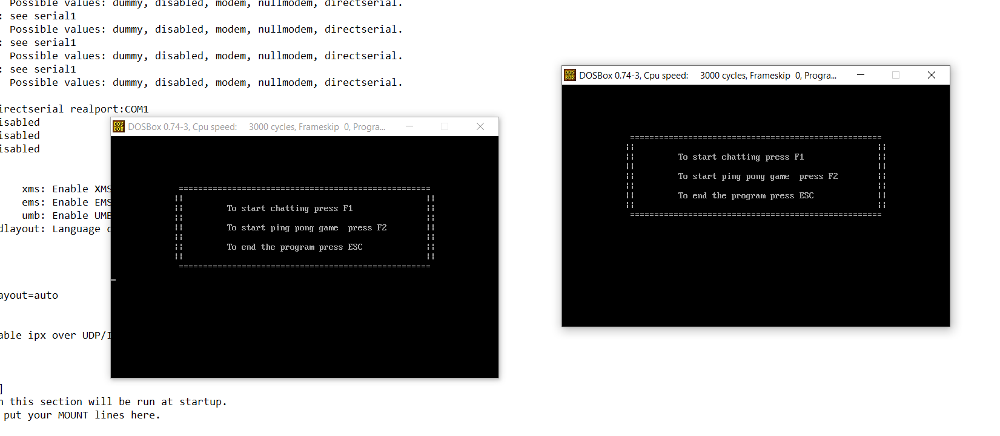
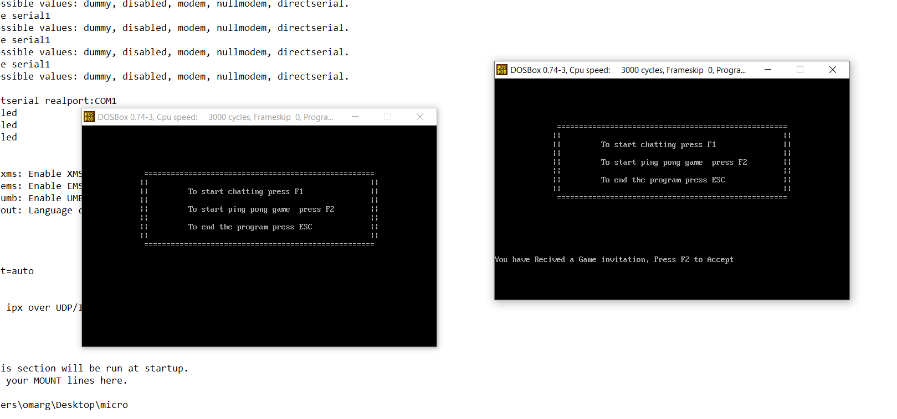
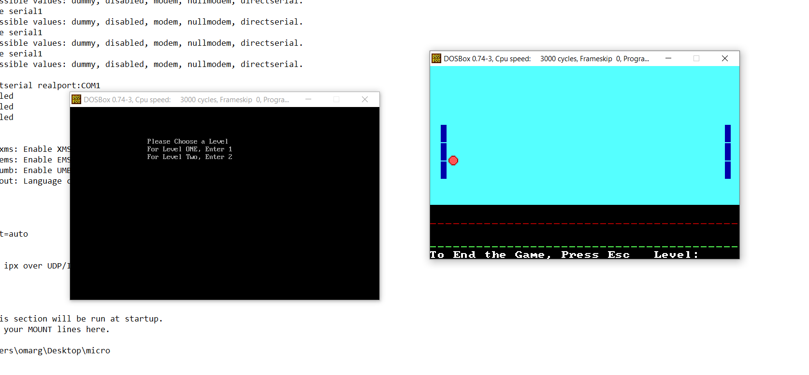
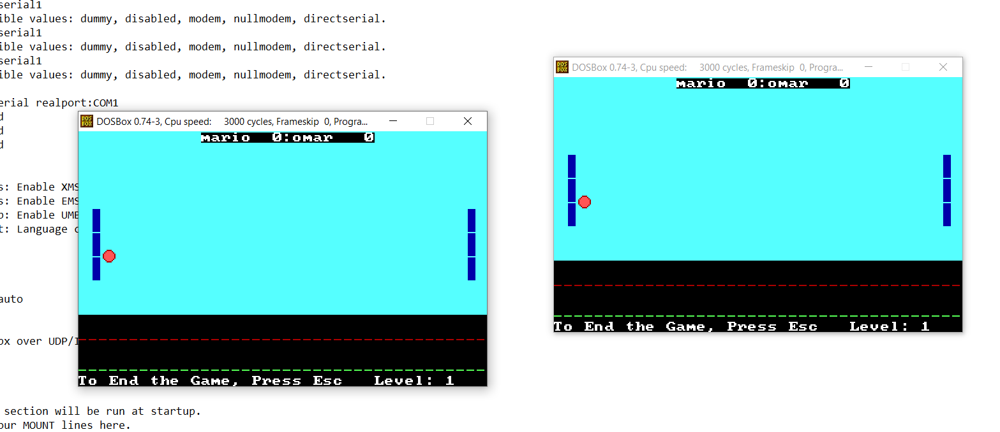
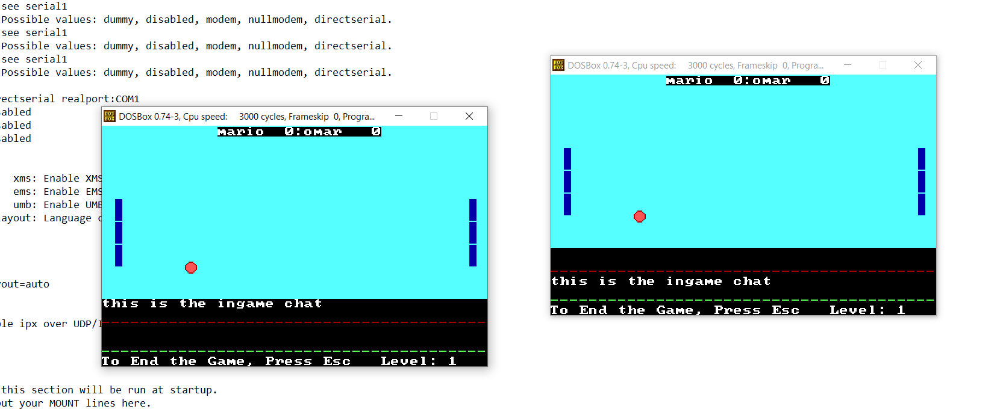
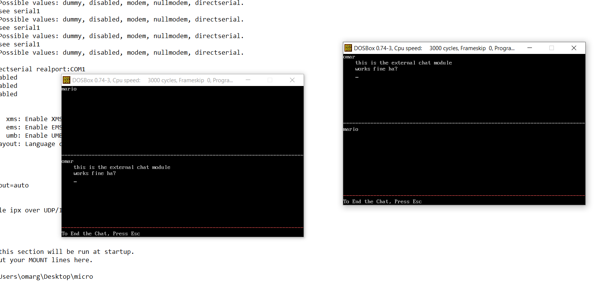

# 🏓 x86-ping-pong

> x86-ping-pong is a 2 level assembly ping pong that could be played by two players on the same device or using x86-serial port.
> The game has two levels. The first level is just the game and the winner is the one who scores 3 points.
> The second level is much harder as moving directions are reversed and the game is a little faster.
> One player is choosing the whether to start the game or start chatting. Then he sends an invitation to the second player (which he could accept or refuse).
> The two players are able to chat in the game, too. 

> Find more about the project specifications [here](https://github.com/BigFish2086/x86-ping-pong/blob/main/assets/Project%20Description.pdf).

## 📷 ScreenShots 



<hr />



<hr />



<hr />



<hr />



<hr />



## 🚩 Get Started 
1. Install [DOSBox](https://www.dosbox.com/).
2. Open ```DOSBox```.
3. Write the following for running the game.
```
mount Z <path/to/game/>
Z:
project
```

Run the game on two PC's connected via cable. 
<b>Game won't start untill the two players join the game.</b>

## ⌨️ Settings

#### Game - Player 1
| Key | Function  	|
|---  |---	        |
| ⬆️ | moving upwords |
| ⬇️ | moving downwords |

#### Game - Player 2
| Key | Function  	|
|---	|---	        |
| w / W | moving upwords |
| s / S | moving downwords |

to use in-game chat press `esc` , send your message and press `esc` once more to get back to the game.

## Contributing

Contributions are what make the open source community such an amazing place to be learn, inspire, and create. Any contributions you make are **greatly appreciated**.

1. Fork the Project
2. Create your Feature Branch (`git checkout -b AmazingFeature-Feat`)
3. Commit your Changes (`git commit -m 'Add some AmazingFeature'`)
4. Push to the Branch (`git push origin AmazingFeature-Feat`)
5. Open a Pull Request

